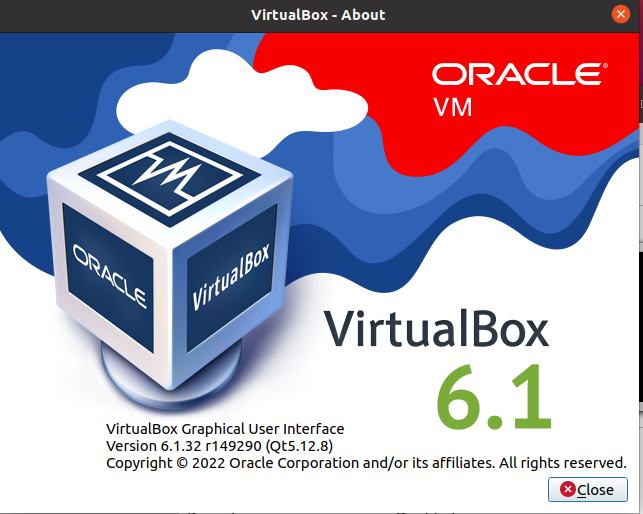

### Задача 1  
- Опишите своими словами основные преимущества применения на практике IaaC паттернов.  
- Какой из принципов IaaC является основополагающим?  

ответ:  
1. CI - первичный процесс при обновлении/развертывания ПО, с использованием сервиса конторля версий. Этот уровень помогает разработчикам на ранних стадиях выявить ошибки в ходе тестирования, устранить и внести изменния в систему контроля версий до внедрения в продакшн.  
2. CD - развертывание, но в ручном режиме, позволяет выпускать изменения небольшими партиями, которые легко откатить на предыдущую версию, в случае ошибок.    
3. CD - continuous deployment - позволяет развертывать ПО автоматически  

Иденпотентность - когла выполнение действий над объектом приводят всегда к одному результату.  

### Задача 2  
Чем Ansible выгодно отличается от других систем управление конфигурациями?  
1. использует технологию push, т.е. не требует развертывание агентов
2. написна на Python, который встроен в Linux
3. популярен, а значит имеет большое сообщество
4. использует существующую ssh инфраструктуру

Какой, на ваш взгляд, метод работы систем конфигурации более надёжный push или pull?  
На мой взгляд метод Pull более надежен, так как клиенты, установленные на машинах запрашивабт изменения конфигурации.  

Задача 3
Установить на личный компьютер:

VirtualBox  
Vagrant  
Ansible    



```
anton@anton-v-m:~$ vagrant version
Installed Version: 2.2.19
Latest Version: 2.2.19
 
You're running an up-to-date version of Vagrant!

```

```
anton@anton-v-m:~$ ansible --version
ansible 2.9.6
  config file = /etc/ansible/ansible.cfg
  configured module search path = ['/home/anton/.ansible/plugins/modules', '/usr/share/ansible/plugins/modules']
  ansible python module location = /usr/lib/python3/dist-packages/ansible
  executable location = /usr/bin/ansible
  python version = 3.8.10 (default, Nov 26 2021, 20:14:08) [GCC 9.3.0]

```

4. Задача (*)
Воспроизвести практическую часть лекции самостоятельно.

- Создать виртуальную машину.  
- Зайти внутрь ВМ, убедиться, что Docker установлен с помощью команды  

виртуальную машину создал и установил docker с помощью VB+Vagrant+ansible

```
vagrant@server1:~$ docker ps
CONTAINER ID   IMAGE     COMMAND   CREATED   STATUS    PORTS     NAMES
```